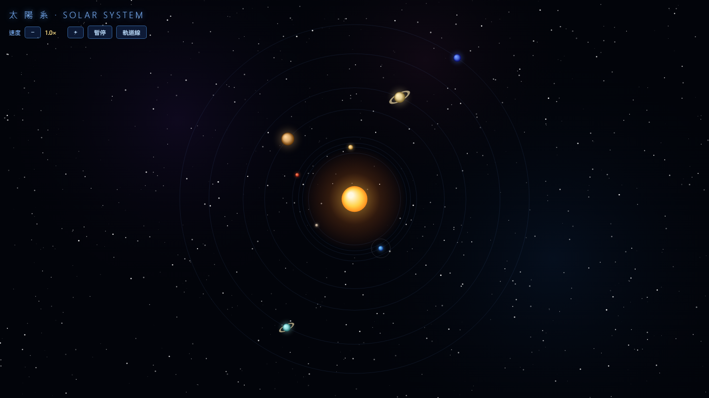

# 太陽系軌道動畫 · Solar System Orbit Animation

使用 **HTML + Canvas** 製作的科幻風格太陽系互動動畫。八大行星依真實比例與公轉週期繞日運行，地球並帶有依真實比例運轉的月球。



## ✨ 特色

- **八大行星**：軌道半徑採用真實天文單位（AU）經視覺壓縮映射，公轉速度依真實週期比例換算（水星最快、海王星最慢）。
- **月球**：半徑為地球的 0.27 倍、公轉週期 27.3 天（約地球年的 1/13.4），繞地球運轉並隨地球一起繞日。
- **互動資訊**
  - 滑鼠**懸停**任一天體 → 顯示名稱、公轉週期、軌道半徑。
  - **點擊**天體 → 釘選並持續顯示資訊；再次點擊同一顆或點擊另一顆才會切換/關閉。
- **科幻視覺**：動態閃爍星空、遠處星雲、脈動太陽光冕、行星立體光暈、土星／天王星光環。
- **控制面板**（左上角）：調整速度（0.1×–8×）、暫停／播放、軌道線開關。

## 🚀 使用方式

無需安裝任何套件或建置工具，純前端單檔即可運行。

### 方法一：直接開啟

雙擊 `solar-system.html`，或用瀏覽器開啟即可。

### 方法二：本機伺服器（建議）

```bash
# Python 3
python -m http.server 8000

# 或 Node.js
npx serve
```

然後在瀏覽器開啟 <http://localhost:8000/solar-system.html>。

## 🕹️ 操作說明

| 操作 | 效果 |
|------|------|
| 滑鼠懸停天體 | 暫時顯示該天體資訊 |
| 點擊天體 | 釘選，持續顯示資訊 |
| 再次點擊同一天體 | 取消釘選 |
| 點擊另一天體 | 切換到新天體 |
| 速度 `−` / `+` | 調整公轉速度 |
| 暫停 / 播放 | 凍結或繼續動畫 |
| 軌道線 | 顯示／隱藏軌道線 |

## 📐 比例說明

為兼顧真實性與可視性，動畫做了以下取捨：

- **保留真實比例**：行星與月球的相對大小、公轉週期比例。
- **視覺壓縮**：軌道距離（用 `sqrt` 壓縮）與月球繞地距離，避免外行星跑出畫面或月球緊貼地球。

## 🛠️ 技術

- 原生 HTML5 Canvas 2D API
- 純 JavaScript，無任何相依套件
- 單一檔案 `solar-system.html`

## 📄 授權

MIT License
